# AGENTS.md Harvest: Battle-Tested Public Agent Rules

## 1. Context & Sources

This harvest reconciles the battle-tested public `AGENTS.md` rules shared by [@MarcosHernanz](https://x.com/MarcosHernanz) (reflecting ~60B tokens of production agent usage) with our versioned profile policy (`policies/default/AGENTS.md`) and project conventions.

### Source Receipts & Artifact Links

All text below was transcribed verbatim from the image attachments of the referenced posts, rather than paraphrased from tweet commentary:

1. **Post 1 — 2026-07-31:** [x.com/MarcosHernanz/status/2083011475346510240](https://x.com/MarcosHernanz/status/2083011475346510240)  
   *Caption:* "I always add this to my AGENTS.md"  
   *Asset:* Image attachment (`HOhX2vFWkAAKg4i.jpg`)
2. **Post 2 — 2026-08-01:** [x.com/MarcosHernanz/status/2083338884117651947](https://x.com/MarcosHernanz/status/2083338884117651947)  
   *Caption:* "Here's another good one"  
   *Asset:* Image attachment (`HOmBpueXoAAZ3Vk.jpg`)
3. **Post 3 — 2026-08-02:** [x.com/MarcosHernanz/status/2083954734487212511](https://x.com/MarcosHernanz/status/2083954734487212511)  
   *Caption:* "After doing ~60B tokens, this is my full AGENTS.md"  
   *Asset:* Image attachment (`HOuxyP3aQAAlqYd.jpg`)
4. **Post 3 Follow-up — 2026-08-02:** [x.com/MarcosHernanz/status/2084060569045541027](https://x.com/MarcosHernanz/status/2084060569045541027)  
   *Caption:* "Almost forgot"  
   *Asset:* Image attachment (`HOwSCMqa4AE5eBd.jpg`)

---

## 2. Verbatim Transcripts of Harvested Rules

### From Post 1 ([2026-07-31](https://x.com/MarcosHernanz/status/2083011475346510240))
```markdown
# AGENTS.md
- Do not preserve backward compatibility.
- Choose the simplest implementation that
  fully meets the current requirements.
- Prefer established, well-maintained
  libraries over custom implementations.
```

### From Post 2 ([2026-08-01](https://x.com/MarcosHernanz/status/2083338884117651947))
```markdown
# AGENTS.md
- Make architectural decisions for the long term.
  Do not accept a stopgap that only works for now
  and is meant to be replaced later.
```

### From Post 3 ([2026-08-02](https://x.com/MarcosHernanz/status/2083954734487212511))
```markdown
# AGENTS.md
- Do not preserve backward compatibility. Remove obsolete paths instead of adding compatibility layers, fallbacks, or migrations.
- Choose the simplest implementation that fully meets the current requirements. Avoid speculative abstractions, configuration, and indirection.
- Grow the system in layers. Start from the smallest version that works end to end, and add each new capability on top of a product that already works. Never trade a working product for unfinished complexity.
- Keep components modular and concerns clearly separated.
- Prefer established, well-maintained libraries when they reduce overall complexity or improve reliability. Do not reimplement common functionality without a clear reason.
- Lean on the dependencies already in the project before writing your own implementation or adding packages. Do not assume a library lacks a capability without checking its documentation and types.
- Make architectural decisions for the long term. Do not accept a stopgap that only works for now and is meant to be replaced later.
```

### From Post 3 Follow-up ([2026-08-02](https://x.com/MarcosHernanz/status/2084060569045541027))
```markdown
# AGENTS.md
- Study how established products solve the problem before designing a solution. Adopt their proven patterns and conventions rather than inventing an approach from scratch.
```

---

## 3. Three-Bucket Diff: Adopt, Already Have, Reject

| Harvested Rule | Source Post | Bucket | Comparison & Rationale | Target Policy Section |
| :--- | :--- | :--- | :--- | :--- |
| **Rule 1: Backward Compatibility & Migrations**<br>`Do not preserve backward compatibility. Remove obsolete paths instead of adding compatibility layers, fallbacks, or migrations.` | [2026-07-31](https://x.com/MarcosHernanz/status/2083011475346510240)<br>[2026-08-02](https://x.com/MarcosHernanz/status/2083954734487212511) | **Reject (Unconditional Form) / Already Have (Application Clean Cutover)** | **Reject reason:** Unconditionally dropping backward compatibility or migrations breaks live production/staging databases and running services. Hernanz confirmed in replies this was strictly for userless greenfield prototypes (*"Because I have no users in my side projects... I only add it when I start a new project"*). `policies/default/AGENTS.md` §10 explicitly mandates forward- and backward-compatible schema migrations. For application-level refactors, our delivery contract already enforces clean cutover without leftover shims or aliases. | None (retain §10 safety; application cutover covered) |
| **Rule 2: Simplicity First**<br>`Choose the simplest implementation that fully meets the current requirements. Avoid speculative abstractions, configuration, and indirection.` | [2026-07-31](https://x.com/MarcosHernanz/status/2083011475346510240)<br>[2026-08-02](https://x.com/MarcosHernanz/status/2083954734487212511) | **Adopt** | **Adopt reason:** Directly counters the recurring failure mode where agents build speculative wrapper classes, unnecessary configuration hierarchies, or prematurely generalized abstractions for a concrete bug or feature. | `policies/default/AGENTS.md` §3 (Engineering & Implementation Principles) |
| **Rule 3: Layered Growth**<br>`Grow the system in layers. Start from the smallest version that works end to end, and add each new capability on top of a product that already works. Never trade a working product for unfinished complexity.` | [2026-08-02](https://x.com/MarcosHernanz/status/2083954734487212511) | **Adopt** | **Adopt reason:** Directly strengthens §2 ("Ship, Don't Build Process") and §3 ("Continuous Completion"). Prevents lanes from tearing apart working systems into an incomplete, broken multi-phase state. | `policies/default/AGENTS.md` §3 (Engineering & Implementation Principles) |
| **Rule 4: Modular Components**<br>`Keep components modular and concerns clearly separated.` | [2026-08-02](https://x.com/MarcosHernanz/status/2083954734487212511) | **Adopt** | **Adopt reason:** Formalizes modular separation across packages and adapters, preventing cross-domain coupling and reinforcing §2 ("Harness-Agnostic Portable Design"). | `policies/default/AGENTS.md` §3 (Engineering & Implementation Principles) |
| **Rule 5: Prefer Established Libraries**<br>`Prefer established, well-maintained libraries when they reduce overall complexity or improve reliability. Do not reimplement common functionality without a clear reason.` | [2026-07-31](https://x.com/MarcosHernanz/status/2083011475346510240)<br>[2026-08-02](https://x.com/MarcosHernanz/status/2083954734487212511) | **Adopt** | **Adopt reason:** Prevents agents from hand-rolling brittle custom implementations of common parsing, formatting, or networking primitives when standard, tested libraries exist. | `policies/default/AGENTS.md` §3 (Engineering & Implementation Principles) |
| **Rule 6: Leverage Project Dependencies**<br>`Lean on the dependencies already in the project before writing your own implementation or adding packages. Do not assume a library lacks a capability without checking its documentation and types.` | [2026-08-02](https://x.com/MarcosHernanz/status/2083954734487212511) | **Adopt** | **Adopt reason:** Solves a major agent blindspot: adding redundant external dependencies when an already-imported dependency provides the needed functionality out of the box. | `policies/default/AGENTS.md` §3 (Engineering & Implementation Principles) |
| **Rule 7: Long-Term Architecture**<br>`Make architectural decisions for the long term. Do not accept a stopgap that only works for now and is meant to be replaced later.` | [2026-08-01](https://x.com/MarcosHernanz/status/2083338884117651947)<br>[2026-08-02](https://x.com/MarcosHernanz/status/2083954734487212511) | **Adopt** | **Adopt reason:** Explicitly forbids agents from shipping dirty monkey-patches, hardcoded local bypasses, or temporary shims that degrade maintainability. | `policies/default/AGENTS.md` §3 (Engineering & Implementation Principles) |
| **Rule 8: Research Proven Patterns**<br>`Study how established products solve the problem before designing a solution. Adopt their proven patterns and conventions rather than inventing an approach from scratch.` | [2026-08-02](https://x.com/MarcosHernanz/status/2084060569045541027) | **Adopt** | **Adopt reason:** Encourages agents to investigate prior art and established conventions before inventing novel, bespoke architectures. | `policies/default/AGENTS.md` §3 (Engineering & Implementation Principles) |

---

## 4. Proposed Structure for Instruction Files

The policy file (`policies/default/AGENTS.md`) has grown by accretion as hard-won operational lessons were appended. To maintain high instruction following and legibility as the document scales, we propose categorizing sections into four clean operational tiers **without deleting or weakening any existing rule**:

```mermaid
graph TD
    A[AGENTS.md / CLAUDE.md] --> T1[Tier 1: Core Principles & Governance]
    A --> T2[Tier 2: Engineering & Quality Principles]
    A --> T3[Tier 3: Execution, Review & Lifecycle Protocols]
    A --> T4[Tier 4: Environmental Invariants & Operational Directives]

    T1 --> T1a[1. Authority & User Primacy]
    T1 --> T1b[4. GitHub-Native Work Contract & Memoryless Model]

    T2 --> T2a[Engineering Principles: Simplicity, Layers, Dependencies]
    T2 --> T2b[Scope Confinement & Clean Cutovers]

    T3 --> T3a[2. Role-Based Routing & Bounded Concurrency]
    T3 --> T3b[5. Lifecycle States & Content-Bound Evidence]
    T3 --> T3c[6. Review & Approval Integrity]
    T3 --> T3d[7. Persistent Signed-In QA Standards]
    T3 --> T3e[8. Visual Plans & Asset Integration]
    T3 --> T3f[9. Superboard & Issue Tracking]

    T4 --> T4a[10. Safe DDL & Bounded Backfills]
    T4 --> T4b[11. Preserved System Invariants & Production Exclusion]
    T4 --> T4c[12. Operational Tooling & Timestamped Incident Directives]
```



### Proposed Tiers
1. **Tier 1: Stable Core Principles & Governance**
   - User primacy and operator authority (§1).
   - Authoritative GitHub-native issue and work contract (§4).
2. **Tier 2: Engineering & Quality Principles (Harvested Standards)**
   - Simplicity first and avoiding speculative abstraction.
   - Layered growth starting from working software.
   - Dependency reuse, checking documentation/types, and modularity.
   - Long-term architectural choices versus stopgaps.
   - Scope confinement and clean application cutovers (§3).
3. **Tier 3: Execution, Review & Lifecycle Protocols**
   - Role-based routing, two-strike escalation, and RAM hygiene (§2).
   - Content-bound review and QA freshness (§5).
   - Review integrity, anti-self-approval, and focused evaluation (§6).
   - Persistent signed-in QA and defect closure contracts (§7).
   - Visual plans and native asset integration (§8).
   - Superboard card states and aggregation (§9).
4. **Tier 4: Environmental Invariants & Incident-Learned Directives**
   - Strict production exclusion and staging isolation (§11).
   - Safe DDL forward/backward compatibility (§10).
   - Timestamped incident directives (e.g., fetch-before-dispatch, sidecar health, Telegram premium formatting, build slot protocol).
   - Quick invocation and operational tooling (§12).

---

## 5. Summary of Applied Policy Updates

The adopted rules are codified directly under Section 3 of `policies/default/AGENTS.md` under a new subsection:
`### Engineering & Implementation Principles (Harvested Standards)`

This integrates:
- Simplicity first (Rule 2)
- Layered growth (Rule 3)
- Modular components and separation of concerns (Rule 4)
- Prefer established libraries & leverage existing dependencies (Rules 5 & 6)
- Long-term architectural decisions (Rule 7)
- Research proven patterns (Rule 8)
- Explicit clarification on clean cutovers vs. DDL forward/backward compatibility (Rule 1 reconciliation with §10).
