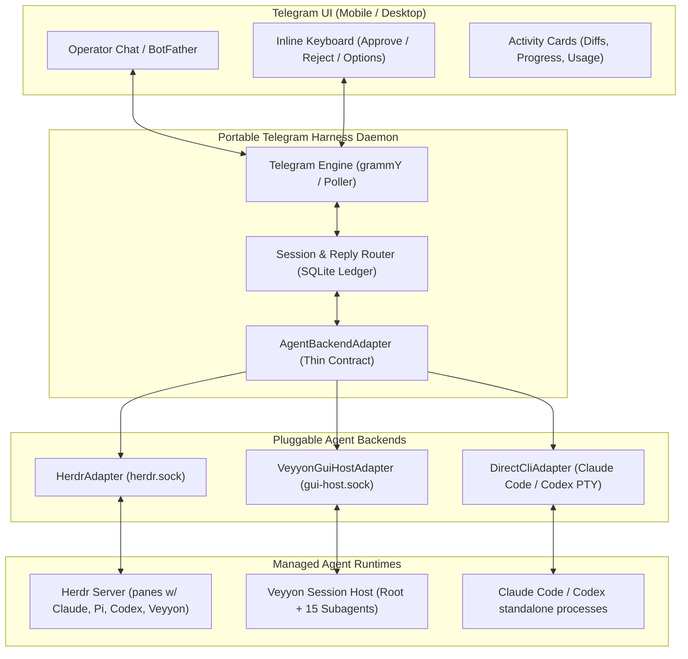

# Veyyon-Side Surface Inventory & Harness-Agnostic Architecture for Telegram Harness

**Author:** Antigravity (TgHarnessSurface lane)  
**Date:** 2026-09-08  
**Scope:** Runtime inventory of Veyyon 1.4.0, GUI Host protocol (`fork/feat/gui`), Native Control Bridge (`fork/feat/telegram-native-control`), installed Telegram extension (`~/.veyyon/telegram`), Herdr Socket API (`0.9.0`), existing Telegram agent bridges, and a harness-agnostic adapter contract.

---

## 1. Executive Summary & Operator Directives

The operator has tasked us with designing a complete agent-management harness inside Telegram ("something very similar to T3 Code, but in Telegram"):
1. **Manage sessions & agents:** See what each agent is doing across processes or panes.
2. **Prompt & Steer:** Send instructions to idle or busy agents.
3. **Decisions & Approvals:** Answer questions, approve/reject tool calls with interactive buttons.
4. **Media & Artifacts:** Inspect Git diffs, PR summaries, and screenshots.
5. **Usage & Quotas:** Real-time visibility into token usage, cost, and provider window resets.
6. **Harness-Agnostic Design:** Thin adapter contract that decouples the Telegram layer from any single runtime, enabling it to drive **Veyyon**, **Herdr-managed terminal agents (Claude Code, Codex, Pi, OpenCode)**, and standalone workflows without over-engineering.

---

## 2. Comprehensive Runtime Surface Inventory

### 2.1 Veyyon 1.4.0 Binary & Extension API (`@veyyon/coding-agent`)

The currently installed Veyyon 1.4.0 runtime exposes an in-process extension API (`pi: ExtensionAPI`) used by `~/.veyyon/telegram/index.ts`:

| Surface / Symbol | Kind | Capabilities & Contract | Telegram Suitability |
| :--- | :--- | :--- | :--- |
| `pi.on("session_start", cb)` | Hook | Fired when a root session begins. `ctx.sessionManager.getSessionId()`, `ctx.cwd`, `ctx.model`. | **Active:** Used to claim bot lease and initiate long-polling. |
| `pi.on("session_switch", cb)` | Hook | Fired on in-TUI session switches (`ctx.sessionManager.getSessionId()`). | **Active:** Used to re-point bot lease and correlation index. |
| `pi.on("message_start", cb)` | Hook | Fired when assistant/user message begins. | **Active:** Resets streaming buffers and chunk trackers. |
| `pi.on("message_update", cb)` | Hook | Assistant text deltas (`event.assistantMessageEvent.delta`). | **Active:** Debounced (1500ms) Telegram message editing. |
| `pi.on("message_end", cb)` | Hook | Final assistant turn text. | **Active:** Flushes final text chunks (capped at 3800 chars). |
| `pi.on("tool_call", cb)` | Hook | Intercepts tool calls. Returns `{ block: true, reason }` to cancel. | **Partial:** Used by `DangerousToolGuard` to block mutations. Lacks interactive user approval wait. |
| `pi.on("session_shutdown", cb)` | Hook | Fired on session exit (2s budget). | **Active:** Stops poller, releases lease in `bot_pool.db`. |
| `pi.sendUserMessage(text, opts)` | Method | Submits prompt to session. `opts.deliverAs`: `"followUp"` or `"steer"`. | **Active:** Delivers inbound Telegram text to the LLM. |
| `ctx.abort()` | Method | Aborts active LLM turn / streaming response. | **Active:** Triggered by `/cancel`, `/stop`, `/abort`. |
| `ctx.isIdle()` | Method | Checks if session is waiting for input vs generating. | **Active:** Decides whether message starts turn or steers. |
| `session.getTodoPhases()` | Method | Returns structured todo phases and task states. | **Available:** Exposes live todo board in-memory. |

**Current Limitations in Extension API:**
- **Single-Root Affinity:** Only one interactive root session can bind the extension per process. Background subagents (`TaskTool`, `AgentRegistry`) do not trigger `session_start` and cannot be directly prompted or listed via `pi`.
- **No Native Media Ingestion:** `pi.sendUserMessage` only takes string text; attachments require multi-modal prompt injection.

---

### 2.2 Veyyon GUI Host Action Protocol (`fork/feat/gui`)

Located in `packages/coding-agent/src/gui-host/`, this is a high-performance **line-delimited JSON Unix/TCP socket protocol** (`~/.veyyon/gui-host.sock` or `tcp:127.0.0.1:<port>`) supporting 53 structured actions and 26 snapshot sections.

| Category | GUI Host Action (`file:symbol`) | Wire Payload & Behavior | Telegram Relevance |
| :--- | :--- | :--- | :--- |
| **Session Control** | `sessions.ts:ListSessions` | Returns snapshot `Sessions` (id, title, cwd, updated_at, message_count). | **High:** List all past/active sessions for `/resume` picker. |
| | `sessions.ts:OpenSession` | Activates session by ID; emits `ActiveSession` and `Transcript`. | **High:** Switch active session from Telegram. |
| | `sessions.ts:CreateSession` | Creates fresh session in workspace directory (`workspace`, `title`). | **High:** Start new session from Telegram `/new`. |
| | `sessions.ts:CompactSession` | Runs context compaction on target session. | **Medium:** Remote `/compact` command. |
| | `sessions.ts:LoadTranscript` | Returns full `Transcript` entries. | **High:** Replay past conversation or export history. |
| **Prompt & Turn** | `turn.ts:SubmitPrompt` | Submits prompt (`text`, `attachments`, `session`). | **High:** Inbound message delivery with attachments. |
| | `turn.ts:Steer` | Steers running turn at next tool boundary. | **High:** Inbound steer while agent is busy. |
| | `turn.ts:FollowUp` | Enqueues prompt to run after current turn ends. | **High:** Queued messages while agent is busy. |
| | `turn.ts:AbortTurn` | Immediately halts streaming generation. | **High:** `/cancel` or `/abort` button. |
| | `turn.ts:SetQueueMode` | Configures queue behavior (`"Steer"` vs `"Queue"`). | **Medium:** Control whether busy messages interrupt. |
| **Decisions & Approvals** | `turn.ts:RespondToInteraction` | Answers pending interaction (`interaction_id`, `response`). | **Critical:** Resolves `ApprovalInteraction`, `QuestionInteraction`, `PlanInteraction` with inline buttons. |
| **Changes & Diffs** | `changes.ts:RefreshChanges` | Returns Git status, file list, additions/deletions, and **unified diff**! | **Critical:** Generates instant Git diff cards for Telegram. |
| | `changes.ts:SelectChangeScope` | Toggles `"WorkingTree"` vs `"Staged"`. | **High:** Diff inspection before commit. |
| **Files** | `files.ts:LoadFileTree`, `ReadFile` | Browse and view project files. | **Medium:** Send file snippets to chat. |
| **Agents & Subagents** | `agents.ts:agentsSection` | Snapshot `Agents` (id, display_name, kind, status, parent, scope). | **Critical:** Live subagent roster (15+ workers) visibility. |
| | `agents.ts:SpawnTask` | Programmatically spawns a subagent task. | **High:** Delegate task from Telegram. |
| | `agents.ts:CancelTask` | Cancels a running subagent by `task_id`. | **High:** Kill runaway subagent from Telegram. |
| **Usage & Diagnostics** | `diagnostics.ts:GetUsage` | Returns `UsageTotals` (input/output tokens, cache read/write, microUSD). | **Critical:** Real-time token and cost cards. |
| | `diagnostics.ts:GetContextBreakdown`| Returns category token breakdown (system, tools, messages, files). | **High:** Context window health monitoring. |
| | `diagnostics.ts:RefreshDiagnostics`| Host CPU, RSS/heap memory, MCP server status. | **High:** Host RAM health monitoring. |

---

### 2.3 Veyyon Native Telegram Control Host (`fork/feat/telegram-native-control`)

Located in `packages/coding-agent/src/native-control/`:
- **Symbol:** `Symbol.for("veyyon.telegram.native-control-host.v1")` on `globalThis`.
- **Authentication:** Strict 4-way tuple match (`authToken`, `actorId`, `chatId`, `sessionId`).
- **Methods:**
  - `listAgents(request)`: Queries `AgentRegistry.global()` filtered by session scope and sorted by last activity. Returns ID, name, status, summary.
  - `getAgentDetail(request)`: Fetches agent activity progress and last assistant response text.
  - `createSession(request)`: Creates and persists a new session in an allowlisted workspace directory.
- **Suitability:** Good in-process building block, but restricted to in-process calls and currently limited to agent listing/session creation.

---

### 2.4 Installed Telegram Extension (`C:/Users/wkiri/.veyyon/telegram`)

An operational Telegram bot pool and session extension running on Bun:
- **`poller.ts`**: Long-polling transport against `https://api.telegram.org/bot<token>/`.
  - SQLite update ledger (`bot_pool.db` / `veyyon_bridge_state.db`) with WAL mode, ACID ingest, and idempotency.
  - Strict allowlist authentication (`chatId === fromId && allowFrom.includes(fromId)`).
  - Outbound reply correlation: Tracks `botId:chatId:messageId` -> `sessionId:requestId:decisionId`.
  - Interactive decision callbacks: Dispatches inline button taps via `python ~/.veyyon/workflows/decision_workflow.py resolve-callback`.
- **`types.ts`**: Complete typed contracts for bot leases, Telegram updates, callbacks, and correlation bridges.
- **`sanitizer.ts`**: HTML escaping, token fingerprinting, secret redaction (`sk-...`, passwords).

---

### 2.5 Superboard & Portable Workflow Surface (`~/.veyyon/workflows/`)

- **`ledger.py`**: Local structured request ledger (`ledger.json`) tracking `prompt`, `session`, `owner`, `criteria`, `state`, `blocker`, `next_action`.
- **`decision_workflow.py`**: Issue-based and callback-based human decision state machine.
  - `python decision_workflow.py resolve-callback --id <DEC-ID> --choice <CHOICE-ID>` resolves decision blockers and unblocks ledger items.
- **`veyyon usage --json`**: Native CLI command producing machine-readable JSON for all configured LLM providers:
  - Supports `google-antigravity`, `anthropic`, `openai-codex`.
  - Reports exact remaining fraction, used fraction, reset timestamp (`resetsAt`), reset credits, and window types (daily, 5h, 7d, 30d).

---

### 2.6 Herdr Socket API (`herdrdev/herdr` v0.9.0)

Herdr exposes a line-delimited JSON-RPC socket API over Unix socket (`~/.config/herdr/herdr.sock`) or Windows Named Pipe (`HERDR_SOCKET_PATH`):

| Method | Parameters | Return Result | Automation Capability |
| :--- | :--- | :--- | :--- |
| `session.snapshot` | `{}` | Workspaces, tabs, panes, and agent records. | Bootstrap entire multi-agent hierarchy at once. |
| `agent.list` | `{}` | Array of `AgentInfo` records. | Discover all running agents across all panes. |
| `agent.get` | `{"target": "w1:p1"}` | `AgentInfo` (status, agent type, cwd, title). | Inspect specific agent health and state. |
| `agent.prompt` | `{"target": "...", "text": "...", "wait": {...}}` | `AgentPrompted` | Deliver prompt with bracketed paste mode; optional wait. |
| `agent.send_keys` | `{"target": "...", "keys": ["esc", "enter"]}` | `ok` | Send interactive keyboard navigation (y/n, arrow keys). |
| `agent.read` | `{"target": "...", "source": "recent-unwrapped", "lines": 100}` | `read.text` (UTF-8, ANSI stripped) | Read actual terminal screen and transcript history. |
| `agent.wait` | `{"target": "...", "until": ["blocked", "done"]}` | `AgentInfo` | Event-driven block waiting for question/completion. |
| `agent.start` | `{"name": "...", "kind": "codex", "pane": "..."}` | `AgentStarted` | Spawn a new agent instance into an existing pane. |
| `events.subscribe` | `{"subscriptions": [{"type": "pane.agent_status_changed"}]}` | Stream of events | Real-time push notifications when agents finish or block! |

---

## 3. Survey of Existing Deep Telegram Agent Bridges

| Implementation | Runtime / Target | Ingress / Transport | Key Architectural Patterns & Reusable Elements |
| :--- | :--- | :--- | :--- |
| **`Wladefant/pi-telegram-manager`** | Pi (`@earendil-works/pi`) | Long-polling / Telegram Bot API | **Highly Reusable:**<br>1. **Tool call activity cards:** Collapsible Telegram blocks showing tool name, arguments, and live status (⏳ -> ✅ / ❌), with stdout folded in.<br>2. **Large output truncation & attachment:** Truncated outputs automatically attach the full payload as a `.txt` file (up to 25 MiB).<br>3. **Typing loop & draft preview:** Streams updates smoothly to avoid rate-limiting.<br>4. **Interactive session picker:** `/resume` lists recent sessions with inline buttons.<br>5. **Queue on busy:** Inbound messages while busy are queued; edits rewrite queue. |
| **`hanxiao/claudecode-telegram`** | Claude Code | Webhook (`cloudflared`) + Tmux PTY | 1. **Tmux injection:** Sends literal keystrokes via `tmux send-keys -l`.<br>2. **Stop Hook:** `send-to-telegram.sh` runs on Claude completion, extracts last assistant response from `~/.claude/projects/*/` JSONL transcripts, converts markdown to HTML, and sends to Telegram.<br>3. **Pending file semaphore:** Uses timestamped file in `~/.claude/` for typing indicator loop. |
| **`terranc/claude-telegram-bot-bridge`** | Claude Code SDK | Webhook / Long-polling | 1. Persistent session router per Telegram user.<br>2. Maps Telegram voice notes and photos to Claude multi-modal inputs. |
| **`RichardAtCT/claude-code-telegram`** | Claude Code CLI | Node.js child_process / PTY | PTY wrapping with ANSI strip, interactive terminal menu automation via regex matching. |
| **grammY / Telegraf Bots** | Universal Node/Bun | Webhook or Long-polling | Standard TypeScript middleware architecture (`session()`, `conversations()`, `menus()`). Ideal framework for the Telegram frontend. |

---

## 4. Capability Mapping for a Telegram Agent Harness

Here is the exact API mapping for each capability the operator requested:

| Telegram Harness Capability | Veyyon GUI Host (`gui-host.sock`) | Veyyon Ext API / CLI (`index.ts`) | Herdr Socket API (`herdr.sock`) | Status & Gap Assessment |
| :--- | :--- | :--- | :--- | :--- |
| **1. List sessions & agents + state** | `ListSessions`<br>`agentsSection` (`Agents` snapshot) | Missing cross-session listing; only current session in `ctx.sessionManager`. | `session.snapshot`<br>`agent.list` | **Ready in GUI Host & Herdr.**<br>*Herdr gives multi-agent PTYs; GUI Host gives Veyyon-native sessions + subagents.* |
| **2. Send prompt to session** | `SubmitPrompt`<br>`FollowUp`<br>`Steer` | `pi.sendUserMessage(text, { deliverAs })` | `agent.prompt(target, text, wait)` | **Ready across all three.**<br>*GUI Host and Herdr support atomic steer/followup.* |
| **3. Answer ask / decision** | `RespondToInteraction`<br>(handles approval, question, plan) | `resolve-callback` via `decision_workflow.py` | `agent.send_keys`<br>`agent.prompt` (text) | **Ready in GUI Host & Decision Workflow.**<br>*GUI Host handles typed options; Herdr sends terminal keystrokes.* |
| **4. Approve tool call** | `RespondToInteraction`<br>({ approved: true, scope: "session" }) | `DangerousToolGuard` (blocks only; no interactive prompt) | `agent.send_keys(["y", "enter"])` | **Ready in GUI Host.**<br>*Herdr requires regex detection of prompt + sending 'y'.* |
| **5. Abort active turn** | `AbortTurn` | `ctx.abort()` | `agent.send_keys(["ctrl+c"])` or `pane.send_keys(["ctrl+c"])` | **Ready across all three.** |
| **6. View Git diff / changes** | `RefreshChanges`<br>`SelectChangeScope` | Missing (requires running `git diff` via bash) | Missing (run `git diff` via pane or script) | **Built into GUI Host (`ChangesView`).**<br>*For others, trivial shell adapter `git diff`.* |
| **7. View screenshots / media** | `ReadFile`<br>(attachment submission) | Missing in extension API | `pane.graphics.set` (display only; export needs script) | **Small Addition Needed:** Need a standard asset helper (`gh image` URL or Telegram `sendPhoto`). |
| **8. Usage & Quotas** | `GetUsage`<br>`GetContextBreakdown` | `veyyon usage --json` CLI | Missing in Herdr (Herdr does not track LLM tokens) | **Ready via `GetUsage` or `veyyon usage --json`.** |

---

## 5. Host Binding Architecture & Trade-Off Comparison

The operator explicitly requested an evaluation of:
- **Option A:** In-process Veyyon Extension (`index.ts`)
- **Option B:** Veyyon GUI-Host over Socket (`gui-host.sock`)
- **Option C:** Herdr Socket API (`herdr.sock`)
- **Option D:** **Harness-Agnostic Core + Adapter Layer (Recommended)**

### Comparative Trade-Off Matrix

| Dimension | Option A: In-Process Extension | Option B: GUI Host Socket | Option C: Herdr Socket API | Option D: Harness-Agnostic Adapter |
| :--- | :--- | :--- | :--- | :--- |
| **Scope of Control** | Single root Veyyon session only | Full Veyyon process (all sessions, subagents, diffs, files, usage) | Universal (any agent: Veyyon, Pi, Claude Code, Codex in any pane) | Decoupled; switches between Veyyon GUI host, Herdr, or CLI |
| **Subagent Visibility** | None (subagents don't trigger hooks) | Full (`Agents` snapshot, `SpawnTask`, `CancelTask`) | Full (`agent.list`, status `idle`/`working`/`blocked`) | Full (normalizes agent list across backends) |
| **Multi-Agent Management**| Poor (requires 1 bot lease per session) | High (single socket controls all sessions) | High (single socket manages entire workspace/pane tree) | Superior (multi-agent routing in bot middleware) |
| **Structured Decisions** | High via `decision_workflow.py` | Native (`ApprovalInteraction`, `QuestionInteraction`) | Low (raw PTY screen scraping / keystroke injection) | High (normalized decision object with button rendering) |
| **Rich Artifacts (Diff/Usage)**| Low (requires custom CLI calls) | Native (`ChangesView`, `GetUsage`, `ContextBreakdown`) | Low (requires external git/provider CLI calls) | Native (adapter provides diff/usage providers) |
| **Agent Agnosticism** | Zero (tied to Veyyon runtime) | Veyyon only | **Universal (controls any CLI agent)** | **Universal (pluggable backend adapters)** |
| **Crash & Process Isolation**| Zero (if Veyyon crashes, Telegram dies) | Good (GUI host can be independent process/daemon) | High (Herdr daemon survives agent crashes) | High (Telegram bot runs as independent daemon) |

---

## 6. The Recommended Harness-Agnostic Adapter Architecture

To satisfy the operator's directive ("do NOT over-engineer; design it harness-AGNOSTIC: a thin adapter contract so the same Telegram layer works with Veyyon, Pi/omp, Claude Code, Codex, Herdr-managed agents"), the Telegram harness should be built as a **standalone Telegram Bot daemon** (using `grammY` or native TypeScript) implementing a single **`AgentBackendAdapter`** interface.



### 6.1 The Thin Adapter Contract (`agent-backend.ts`)

```typescript
export type AgentLifecycleState = "idle" | "working" | "blocked" | "done" | "unknown";

export interface UnifiedAgentSummary {
  id: string;               // e.g. "w1:p1" or "subagent-wave3"
  name: string;             // human-readable name or alias
  backend: string;          // "herdr" | "veyyon" | "claude"
  status: AgentLifecycleState;
  model?: string;
  projectCwd: string;
  currentActivity?: string; // e.g. "Running pytest on PR 4444"
  updatedAtMs: number;
}

export interface UnifiedDecision {
  id: string;
  agentId: string;
  type: "approval" | "question" | "plan";
  title: string;
  detail: string;
  options?: Array<{ id: string | number; label: string }>;
  requestedAtMs: number;
}

export interface UnifiedDiff {
  repository: string;
  files: Array<{ path: string; status: string; additions: number; deletions: number }>;
  unifiedDiff: string;
}

export interface UnifiedUsage {
  totalTokens: number;
  costMicroUsd?: number;
  providerLimits?: Array<{
    provider: string;
    windowLabel: string;
    usedPercent: number;
    resetsAtUnixMs: number;
  }>;
}

export interface AgentBackendAdapter {
  readonly id: string;
  readonly name: string;

  // 1. Discovery & Lifecycle
  listAgents(): Promise<UnifiedAgentSummary[]>;
  getAgent(agentId: string): Promise<UnifiedAgentSummary | null>;
  
  // 2. Turn Control & Prompting
  sendPrompt(agentId: string, text: string, mode: "turn" | "steer" | "followUp"): Promise<{ accepted: boolean; turnId?: string }>;
  abortTurn(agentId: string): Promise<boolean>;

  // 3. Decisions & Approvals
  listPendingDecisions?(): Promise<UnifiedDecision[]>;
  respondDecision(decisionId: string, response: { approved?: boolean; optionId?: string | number; text?: string }): Promise<boolean>;

  // 4. Artifacts & Inspection
  getRecentOutput(agentId: string, lines?: number): Promise<string>;
  getDiff?(agentId: string): Promise<UnifiedDiff>;
  getUsage?(agentId: string): Promise<UnifiedUsage>;

  // 5. Real-time Events (optional subscription)
  subscribeEvents?(onEvent: (event: { type: string; agentId: string; payload: unknown }) => void): () => void;
}
```

### 6.2 Adapter Implementations

1. **`HerdrAdapter` (Universal Terminal Orchestration):**
   - Connects to `~/.config/herdr/herdr.sock` or `\\.\pipe\herdr` over line-delimited JSON.
   - Implements `listAgents()` via `agent.list`.
   - Implements `sendPrompt()` via `agent.prompt` (with optional `--wait`).
   - Implements `abortTurn()` via `agent.send_keys(["ctrl+c"])`.
   - Implements `getRecentOutput()` via `agent.read(target, { source: "recent-unwrapped", lines: 100 })`.
   - Subscribes to events via `events.subscribe` with `pane.agent_status_changed`.
   - **Why this is awesome:** Instantly supports any agent running in a terminal pane without touching that agent's code.

2. **`VeyyonGuiHostAdapter` (Deep Veyyon Integration):**
   - Connects to `~/.veyyon/gui-host.sock` over line-delimited JSON.
   - Implements `listAgents()` via `agentsSection` (`Agents` snapshot) + `ListSessions`.
   - Implements `sendPrompt()` via `SubmitPrompt`, `Steer`, and `FollowUp`.
   - Implements `respondDecision()` via `RespondToInteraction` (native approval/question options).
   - Implements `getDiff()` via `RefreshChanges` (full staged/unstaged unified diff).
   - Implements `getUsage()` via `GetUsage` + native `veyyon usage --json`.
   - Subscribes to `Snapshot` updates.

3. **Composite Multi-Backend Router:**
   - The Telegram daemon can load **both** adapters simultaneously!
   - Agents running in Herdr terminals appear with prefix `herdr:<pane_id>`.
   - Veyyon in-process subagents appear with prefix `veyyon:<subagent_id>`.
   - The operator can view and control all agents from one unified Telegram bot.

---

## 7. Concrete Next Steps

1. **Phase 1 — Telegram Daemon Shell:** Build a standalone, lightweight daemon using `grammY` and Bun, using the robust SQLite update ledger and correlation logic from `~/.veyyon/telegram/poller.ts`.
2. **Phase 2 — Implement `HerdrAdapter`:** Connect to Herdr's local socket API to enable immediate universal control of any terminal agent (Claude Code, Codex, Pi, Veyyon).
3. **Phase 3 — Implement `VeyyonGuiHostAdapter`:** Connect to `gui-host.sock` for rich Veyyon features: unified diff rendering, interactive approval keyboards, and live token usage.
4. **Phase 4 — Rich UI Cards (T3 Code style):** Add collapsible tool activity cards, screenshot/image sending via Telegram photo API, and provider reset countdowns.
