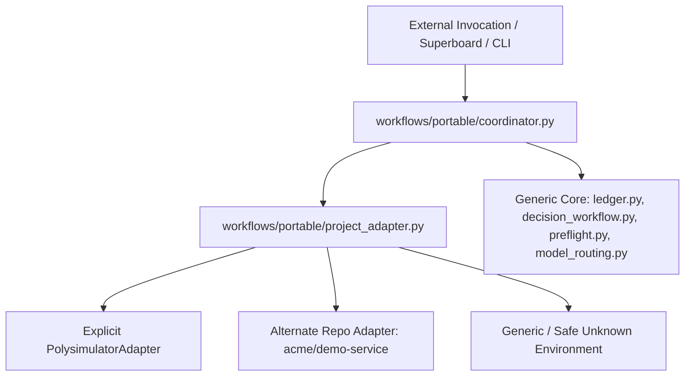
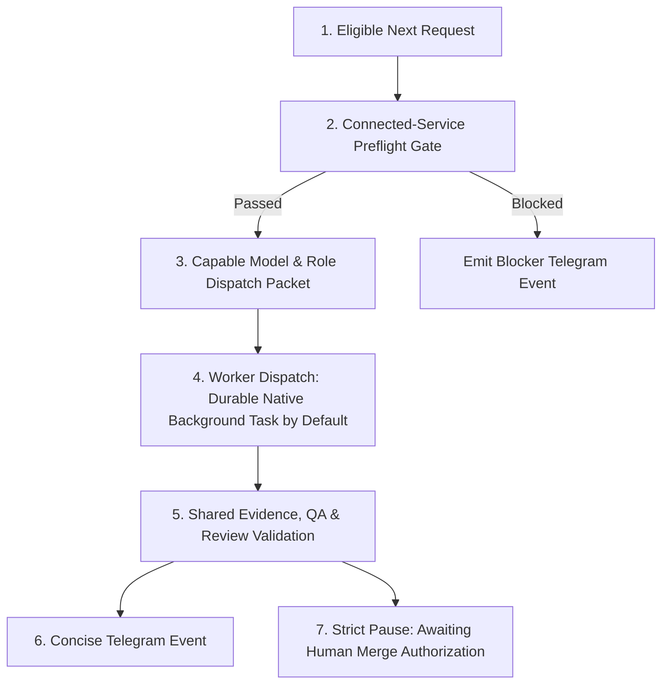

# Portable Workflow Core & Module Integration Guide

A harness-agnostic, pure Python standard library multi-agent coordination core located under `workflows/portable/`.

---

## 1. Architectural Authority & Inviolable Principles

1. **Shared System of Record (Canonical):**
   * **GitHub Issues** and **Superboard (Project #1)** for `Bavariance/polysimulator` are the authoritative shared sources of truth for requirements, task status, human decisions, and verified closure.
   * Remote status always supersedes local caches on conflict.
2. **Local Recovery Cache:**
   * `ledger.json` and `decisions.json` act as machine-local, crash-resilient, atomic restart recovery caches.
   * They eliminate reliance on fictitious native schedulers or polling GitHub APIs continuously.
   * Multi-agent concurrency is protected via advisory file locking (`msvcrt` on Windows, `fcntl` on POSIX) and atomic filesystem replaces (`tempfile.mkstemp` + `os.replace`).
3. **No Auto-Merge & No Auto-Deploy:**
   * Transition to `integration` strictly requires an explicit human authorization record (`authorization.status == "authorized"` with recorded provenance). Self-authorization and default CLI operator trust are rejected.
   * Production deployment, staging promotion, and main branch merges cannot be authorized via issue decisions or autonomous routines.
4. **No Self-Spawn Loop:**
   * The coordinator command is strictly bounded: it executes **one evaluation step** and emits a compact recommendation packet.
   * It never recursively self-spawns worker agents, enters unbounded polling loops, or forks background daemons.
5. **No Credential Exposure:**
   * Quota, balance, and probe utilities sanitize and redact all account identifiers, emails, project refs, and tokens.
6. **Head-Bound Evidence Invalidation:**
   * Git HEAD changes invalidate all head-bound acceptance criteria, QA proof URLs, and review signoffs, automatically resetting state to `implementation`.

---

## 2. Module CLI Interface & Owner Map

| Module | Owning Agent Lane | Architectural Role | CLI Interface | Primary Inputs | Primary Outputs |
| :--- | :--- | :--- | :--- | :--- | :--- |
| **`coordinator.py`** | `PortableWorkflowCoordinator` | Single bounded coordinator combining state, decision sync, preflight gating, normalized usage, and model selection. | `python coordinator.py [--state-dir <dir>] [--json] [--summary] [--no-sync-decisions] [--usage-adapter auto\|file\|veyyon\|direct] [--balance-file <file>]` | `ledger.json`, `decisions.json`, `preflight_evidence/`, `usage_fixture.json` | `CoordinatorPacket` (JSON or terminal summary) |
| **`ledger.py`** | `ImplementRequestLedger` / `FixLedgerInvariants` | Machine-local durable request ledger, transition graph validator, per-criterion evidence verification, and restart recovery. | `python ledger.py [add \| update \| check \| next \| list \| show \| recover] [--ledger <path>]` | `ledger.json` | State transitions, invariant reports, recovery queues |
| **`decision_workflow.py`** | `IntegrateDecisionWorkflow` / `HardenDecisionProvenance` | Asynchronous human decision workflow with strict responder authorization, authored-comment exclusion, and bounded sync. | `python decision_workflow.py [ask \| ingest \| reply \| sync \| show \| list] [--decisions <path>] [--ledger <path>]` | `decisions.json`, GitHub issue comments via `gh` | Verified human decisions, unblocked ledger requests, clarification prompts |
| **`preflight.py`** | `ImplementIntegrationPreflight` | Manifest-driven staging integration preflight gates (Dokploy staging compose, Supabase staging ref, Stripe test mode). | `python preflight.py [check \| probe \| record-evidence \| inventory] [--evidence-dir <dir>] [--json]` | Task manifests, service probe evidence | `PreflightResult` (passed, blocked, not_applicable), probe inventory |
| **`balance_loader.py`** | `ImplementSubscriptionRouter` / `ReviewHarnessStrongModel` | Read-only sanitized subscription usage snapshot loader, multi-window constraint analyzer, and provider quota tracker. | `python balance_loader.py [--normalized] [--adapter veyyon\|file\|direct] [--balance-file <file>] [--json]` | `usage_snapshot_cache.json`, `usage_fixture.json`, or live CLI | `NormalizedBalanceSnapshot` (JSON) |
| **`model_routing.py`** | `ImplementHarnessRouting` / `ImplementSubscriptionRouter` | Capability-first, reset-aware model selection, near-reset Codex promotion, and compact EvidencePacket generation (< 1.5 KB). | `python model_routing.py [--task-type <type>] [--risk-level <level>] [--emit-dispatch] [--adapter veyyon\|file\|direct] [--balance-file <file>]` | `NormalizedBalanceSnapshot` | `HarnessDispatchPacket` (JSON) |
| **`github_plan_renderer.py`** | `IntegrateVisualPlanWorkflow` | Visual plan and evidence recap markdown renderer with badges, timelines, and progress metrics for GitHub issue/PR comments. | `python github_plan_renderer.py [--spec <file>] [--type plan\|recap]` | Plan or recap JSON specification | Formatted GitHub Markdown comment text |
| **`telegram_notifier.py`** | `IntegrateTelegramStatus` | Portable Telegram workflow status notification adapter with strict deduplication, cooldowns, single-sentence formatting, and multi-repo destination resolution. | `python telegram_notifier.py [--packet <file>] [--event-type milestone\|blocker\|decision\|completion] [--project <name>] [--send] [--dry-run] [--test-connection] [--json]` | `CoordinatorPacket` JSON, CLI event arguments, manifest/channel config | `DeliveryReceipt` (JSON or terminal summary), deduplicated Telegram messages |
| **`superboard_adapter.py`** | `PackagePortableCoordinator` | Execution adapter bridging portable coordinator with existing Superboard loop tooling (`super-qa-dispatch.sh`, `super-board-run.sh`, `super_board_runtime`). | `python superboard_adapter.py [--config <file>] [--state-dir <dir>] [--fake-executor] [--real-worker] [--notify-telegram] [--json] [--summary]` | `ledger.json`, `preflight_evidence/`, Superboard project config, `HarnessDispatchPacket` | `AdapterExecutionResult`, exact-SHA QA evidence, Telegram status events |
| **`github_pr_gate.py`** | `FinalizeExecutableRouting` | Deterministic GitHub PR status and review gate verifying CI, GitHub approvals, or source-backed independent automated review artifacts on named non-production branches. | `python github_pr_gate.py --pr <pr_url_or_number> [--head-sha <sha>] [--review-record <artifact.json>] [--policy-config <policy.json>] [--json]` | Live GitHub PR via `gh`, native required-check contexts, optional `portable-review/v1` artifact | `PRGateEvaluation` (`PASSED`, `BLOCKED`, `PENDING`) with detailed gate breakdown |
| **`diagnostics.py`** | `PackagePortableCoordinator` | Unified aggregate system, service, provider, request and host resource diagnostics. Exposes where problems lie, what is missing, distinguishes access from health and stale from failed, and asks user only when true authorization/preference/credential needed with deduplicatable question IDs. | `python diagnostics.py [--state-dir <dir>] [--strict] [--json] [--summary]` (or `python coordinator.py --diagnostics`) | `ledger.json`, `decisions.json`, `preflight_evidence/`, usage snapshots | `DiagnosticReport` (JSON or terminal summary), `human_inputs`, `agent_actions` |

### Automated review artifact contract

`--review-record` reads an independently-produced `portable-review/v1` JSON artifact. It
must bind the repository, PR number, full head SHA, full base SHA, and live PR author. The
reviewer must be a distinct automation actor, and `source` must name that same actor through
an `agent://` or `history://` transcript URI with a SHA-256 digest. Outcomes are exactly
`approved` or `changes_requested`; the latter always blocks. A valid artifact can replace
the GitHub Approve button only where the resolved named policy sets
`require_github_approval` to false. Production-protected bases retain mandatory independent
GitHub `APPROVED` review.

This local gate treats the artifact as advisory trusted-workflow evidence. Schema,
provenance shape, actor separation, and exact-head/base bindings are validated, but this is
not a cryptographic identity guarantee; the supplying workflow must authenticate and retain
the referenced transcript. An author `COMMENTED` review is never represented as GitHub
approval.

---

## 3. Single Bounded Coordinator Command

The coordinator command evaluates current state across all modules in one deterministic pass:

```bash
# Human-readable summary output
python coordinator.py --summary

# Machine-readable JSON output (default)
python coordinator.py --json

# Standalone execution with custom state directory and usage fixture
python coordinator.py \
  --state-dir /path/to/state \
  --usage-adapter file \
  --balance-file /path/to/usage_fixture.json \
  --no-sync-decisions \
  --json
```

### Coordinator Command Options

* `--state-dir <dir>`: Root directory for `ledger.json`, `decisions.json`, and `preflight_evidence/` (defaults to script directory).
* `--ledger <path>`: Explicit override for `ledger.json`.
* `--decisions <path>`: Explicit override for `decisions.json`.
* `--evidence-dir <path>`: Explicit override for `preflight_evidence/` directory.
* `--usage-adapter <auto|file|veyyon|direct>`:
  * `auto` (default): Checks for balance file or fixture; if missing, checks for `veyyon` CLI; falls back to internal normalized snapshot.
  * `file`: Loads normalized metrics from `--balance-file` or `usage_fixture.json`.
  * `veyyon`: Invokes `veyyon usage --json` on host.
  * `direct`: In-memory direct structure.
* `--balance-file <file>`: Path to custom usage JSON fixture.
* `--repo <repo>`: Target GitHub repository (default: `Bavariance/polysimulator`).
* `--no-sync-decisions`: Skip remote GitHub decision synchronization (useful in offline or test environments).
* `--request-id <id>`: Target specific request ID instead of highest-priority eligible request.
* `--json`: Emit machine-readable JSON packet.
* `--summary`: Emit formatted terminal summary.

### Coordinator Output Schema (`CoordinatorPacket`)

```json
{
  "schema_version": "1.0",
  "generated_at_utc": "2026-09-05T09:10:32Z",
  "status": "ready",
  "status_reason": "Request 'req-001' is eligible for execution in state 'implementation'. Preflight passed.",
  "next_action": "Dispatch worker lane using model 'google-antigravity/gemini-3.8-flash:high' (role: task)...",
  "request": {
    "id": "req-001",
    "state": "implementation",
    "task_type": "harness",
    "owner": "ImplementHarnessRouting",
    "prompt": "Task objective...",
    "head": "a1b2c3d4",
    "issue_number": 4545,
    "issue_url": "https://github.com/Bavariance/polysimulator/issues/4545",
    "next_action": "Implement criteria...",
    "pending_criteria": ["AC-1", "AC-2"],
    "labels": ["area:orchestration"]
  },
  "decision_status": {
    "sync_attempted": true,
    "sync_success": true,
    "sync_message": "Sync completed: checked 0 decision(s).",
    "pending_count": 0,
    "blocking_this_request": false,
    "blocking_decision_ids": [],
    "decision_details": null
  },
  "preflight": {
    "evaluated": true,
    "passed": true,
    "status": "passed",
    "required_probes": ["dokploy_staging"],
    "blockers": [],
    "probe_details": {
      "dokploy_staging": "passed"
    }
  },
  "routing": {
    "evaluated": true,
    "recommended_model": "google-antigravity/gemini-3.8-flash:high",
    "recommended_role": "task",
    "fallback_model": "openai-codex/gpt-5.3-codex",
    "promotion_applied": false,
    "cooldown_fallback": false,
    "rationale": "Primary abundant execution lane: Gemini 3.8 Flash (Ultra daily allowance).",
    "quota_context": {
      "provider_statuses": {
        "google-antigravity": "ok",
        "anthropic": "ok",
        "openai-codex": "ok",
        "xai-oauth": "dormant"
      }
    },
    "evidence_packet_required": false
  },
  "evidence_packet": null,
  "boundaries": {
    "auto_merge_allowed": false,
    "auto_deploy_allowed": false,
    "self_spawn_loop": false,
    "execution_dispatched": false,
    "shared_authority": "GitHub Issues & Superboard (Project #1)",
    "local_recovery_cache": "ledger.json"
  }
}
```

### Status Meaning & Invariant Actions

* **`ready`**: Request has passed preflight, has no decision blockers, and is ready for worker execution.
  * *Action:* Dispatch worker using recommended model/role for the specified `next_action`.
* **`wait`**: Request is blocked pending human decision (e.g. `decision_blockers`) or is in `awaiting authorization`.
  * *Action:* Background workers must park. Do not speculative branch or burn tokens. Await human response on GitHub issue or explicit authorization in ledger.
* **`block`**: Request has unsatisfied dependencies or missing staging preflight evidence (Dokploy/Supabase/Stripe).
  * *Action:* Run safe read-only preflight probe (`python preflight.py probe --all`) or complete upstream dependency requests.
* **`done`**: All requests in ledger are in terminal `done` state or no active requests exist.
  * *Action:* No work remaining. Conclude session or await new operator prompts.

### 3.1 Aggregate Diagnostics & Problem Identification Command (`diagnostics.py`)

When systems stall, dependencies fail, or preflight evidence expires, the operator or orchestrator can run the read-only diagnostic command to evaluate all configured systems, requests, and services in a single bounded pass:

```bash
# 1. Standalone diagnostics with formatted terminal summary
python diagnostics.py --summary

# 2. Machine-readable JSON output
python diagnostics.py --json

# 3. Via coordinator extension point
python coordinator.py --diagnostics --summary

# 4. Via continuation driver diagnostic inspection
python continuation_driver.py --diagnostics

# 5. Diagnostic inspection with custom state directory
python diagnostics.py --state-dir /path/to/state --summary
```

#### Diagnostic Invariants & Output Semantics

1. **Access vs. Health:**
   * `access_status`: Proves network/auth connectivity to the endpoint (`granted`, `blocked`, `unconfigured`).
   * `health_status`: Evaluates whether the underlying container/database/service is healthy and running expected schema/revision.
   * `live_verified`: Distinguishes active live probes from cached file attestations. **Cached credentials are never claimed as live healthy.**
2. **Stale vs. Failed:**
   * `is_stale`: When evidence age exceeds TTL (`now - timestamp > ttl_seconds`), the state resets to `stale`.
   * **Unknown or stale evidence is NEVER green/healthy.**
   * A stale probe requires a fresh probe execution (`agent_action`), not an assumption of health.
3. **Confirmed Diagnosis vs. Unknown Root Cause:**
   * `confirmed_diagnosis`: Diagnoses with verifiable root cause (e.g., missing test-mode key `sk_test_`, container log query error, or TTL expiration).
   * `unknown_cause`: Failures lacking diagnostic evidence, preventing fabricated conclusions.
4. **Human Input vs. Agent Action:**
   * `human_input_needed = True` ONLY for true authorization gates (`awaiting authorization` merge approval), architectural preferences/tradeoffs (pending `DEC-*` items), or secure credential setup (`sk_test_` missing).
   * Every human input item carries a unique, deduplicatable `question_id` (e.g. `credential:stripe_test:sk_test_key`, `authorization:req-001:merge`, `decision:DEC-001`).
   * **Missing implementation, unwritten tests, and failing tests are strictly AGENT-OWNED actions, never punts to the operator.**
   * **Zero Secret Exposure:** Diagnostics never request or display secret values; they provide secure workstation environment or vault configuration instructions.
5. **Host Resource Telemetry:**
   * Reads host RAM usage via Python standard library (`ctypes` on Windows, `/proc/meminfo` on Linux).
   * Never runs auto-kills or background daemons.
   * If telemetry is unsupported or unavailable, state is strictly marked `unknown` (never assumed healthy).
---

## 4. Standalone Execution (Zero Veyyon Requirement)

The package runs anywhere with standard Python 3.9+ and optionally the GitHub CLI (`gh`):

1. **No External Libraries:** Uses Python standard library only (`argparse`, `json`, `os`, `sys`, `dataclasses`, `hashlib`, `threading`, `time`, `subprocess`).
2. **Missing `gh` Tool:** Automatically skips remote decision sync with an informative notice; local decision evaluations and state transitions continue uninterrupted.
3. **Missing `veyyon` Tool:** With `--usage-adapter file` (or `auto`), reads normalized quota metrics from `usage_fixture.json` with zero host daemon requirement.
4. **Custom State Paths:** Use `--state-dir` or explicit `--ledger` / `--decisions` flags to isolate state in temporary or project directories without touching `~/.veyyon`.

---

## 5. Harness Adapter Integration Instructions

### Adapter A: Veyyon Orchestrator & Goal Mode

When running under Veyyon (with orchestrators like GPT-5.6 Sol or Astra):

1. **Step Evaluation:**
   The interactive orchestrator invokes `python workflows/portable/coordinator.py --json`.
2. **Packet Processing:**
   * Parse returned JSON packet.
   * If `status == "wait"`:
     * Log waiting status: `"Workflow parked waiting on human decision {id} or operator authorization."`
     * Yield turn or enter idle wait. **Never self-authorize or bypass.**
   * If `status == "block"`:
     * If preflight blocked: invoke read-only probe or report missing staging credentials.
   * If `status == "ready"`:
     * Read `routing.recommended_model` and `routing.recommended_role`.
     * Spawn execution lane via Veyyon `task` tool:
       ```json
       task(
         tasks=[{
           "agent": packet["routing"]["recommended_role"],
           "task": packet["next_action"]
         }]
       )
       ```
   * If `status == "done"`:
     * Mark session goal complete via `goal(op="complete")` and yield final summary.

### Adapter B: OpenAI Codex / Anthropic Claude / Custom Runners

Generic external orchestrators (Codex, Claude, Claude Code, GitHub Actions, custom runners) use the coordinator as an idempotent oracle for step evaluation:

1. **Step Evaluation:**
   Invoke `python workflows/portable/coordinator.py --usage-adapter file --balance-file workflows/portable/usage_fixture.json --json`.
2. **Canonical Worker Execution:**
   Do not implement custom host execution loops that bypass preflight or forge execution results. Instead, follow the canonical native background prepare/record/complete recipe documented in `WORKER_EXECUTION.md` (§2):
   * Call `python workflows/portable/worker_backend.py --prepare-native ...` to preflight and persist a dispatch ticket.
   * Launch the returned prompt and schema using your host's non-blocking background task facility.
   * Bind the resulting task handle with `--record-native`.
   * Finalize the task with `--complete-native` using the delivered structured result.
3. **Continuous Multi-Stage Progression:**
   To drive multi-stage workflows across authorized requests continuously without writing custom loops, invoke the verified driver with explicit state directory and repository root:
   ```bash
   python workflows/portable/continuation_driver.py \
     --request-id <authorized-id> \
     --state-dir <dir> \
     --repo-root <git-repository> \
     --max-steps 12
   ```

### Adapter C: Optional Telegram Notification Adapter

For real-time human updates, an external notification adapter (`telegram_notifier.py`, owned by `IntegrateTelegramStatus`) consumes coordinator packets or ledger state changes and emits one-sentence deduped updates without polling spam or parallel state tracking:
* **Canonical System of Record:** Status is always anchored to GitHub Issues and Superboard; Telegram is strictly an outbound, read-only push channel for status notifications. There is no inbound Telegram message or command processing.
* **Active Typed Decisions:** Decision requests (`DEC-*`) and questions are answered via GitHub issue comments (or `decision_workflow.py reply`). Status messages provide canonical GitHub links directing operators to the discussion.
* **Deduped Event Types:** Emits events exclusively on major milestones (`milestone`), active blockers (`blocker`), decision requests (`decision`), or closure (`completion`), referencing the canonical issue URL.
* **Generic Multi-Repo Transport:** Resolves per-project slot destinations dynamically via manifest/affinity matching (`Bavariance/polysimulator`, `Wladefant/super-board`, `soundcore`, `dubai-holding`, `heylolo`, `heyloweb`).
* **Credential Redaction:** Tokens, bearer headers, and user paths are sanitized before dispatch. Bot tokens are held in-memory only.
* **Deduplication & Cooldown:** Uses SHA256 event signatures with 24-hour deduplication, 5-minute per-request cooldowns, and a 30-second global rate limiter to eliminate spam.

```bash
# Check bot connectivity and allowlisted destinations (read-only getMe)
python telegram_notifier.py --project Bavariance/polysimulator --test-connection --json

# Dry-run evaluate a milestone status event without network transmission
python telegram_notifier.py \
  --event-type milestone \
  --project "Bavariance/polysimulator" \
  --request-id "req-001" \
  --summary "Request transitioned to QA on commit 693de377." \
  --link "https://github.com/Bavariance/polysimulator/issues/4543" \
  --dry-run \
  --json

# Consume a CoordinatorPacket file and dispatch if eligible
python telegram_notifier.py --packet coordinator_output.json --send
```
---

## 6. Export Procedure & Verification

To export the portable workflow package to an isolated directory using the canonical standard library export recipe:

```bash
# Export destination
EXPORT_DIR="/tmp/portable_workflow"
python -c "
import json, os, shutil

src_dir = 'workflows/portable'
dst_dir = '${EXPORT_DIR}'
manifest_path = os.path.join(src_dir, 'manifest.json')
with open(manifest_path, 'r', encoding='utf-8') as f:
    manifest = json.load(f)

required_files = manifest.get('export', {}).get('required_files', [])
os.makedirs(dst_dir, exist_ok=True)
for rel_path in required_files:
    src_file = os.path.join(src_dir, rel_path)
    dst_file = os.path.join(dst_dir, rel_path)
    os.makedirs(os.path.dirname(dst_file), exist_ok=True)
    shutil.copy2(src_file, dst_file)
print(f'Exported {len(required_files)} required files to {dst_dir}')
"

# Run standalone verification in export directory (separate state, no remote sync)
cd "$EXPORT_DIR"
python coordinator.py --summary --no-sync-decisions
```
---

## 7. Multi-Repository Portability & Project Adapters

The workflow core is strictly decoupled from any single product or environment through `workflows/portable/project_adapter.py`.

### 7.1 Generic Core vs Project Adapter Architecture



1. **Generic Core:** Accepts arbitrary repository (`--repo` or `--project-config`), Superboard project number, base branch, and staging definitions. Zero project-specific strings are hardcoded into validation logic.
2. **PolySimulator Adapter (`polysimulator`):**
   * Encapsulates authoritative staging compose ID (`TU7b_dY9l9_nCas6YBNwj`) and staging DB ref (`hgzyqmaanndcimnclxtv`).
   * Inviolable invariant: **ZERO production or main DB access**. Main DB (`zaraprptkegxqpvnsubu`) and production compose ID (`vpyL-7TDEUREH6Uo_y1sb`) are strictly rejected.
3. **Alternate Repository Fixture (`acme/demo-service`):**
   * Configured via `workflows/portable/fixtures/alternate_repo_config.json` (project #42, `main` base branch).
   * Proves zero PolySimulator defaults leak into packet summaries or boundaries.
4. **Safe Unknown Environment (`isolated/unknown-project`):**
   * Unconfigured staging environment safely exempts local_doc / harness tasks as `not_applicable`.
   * Deployable tasks requiring external staging are cleanly BLOCKED with unconfigured explanation, never falling back to PolySimulator staging.

### 7.2 Superboard Repository Discovery & Native Config Support

The user's authoritative Superboard repository was discovered:
* **GitHub Repository:** `Wladefant/super-board` (URL: `https://github.com/Wladefant/super-board`, forked from `EricTechPro/super-board`).
* **Local Checkout:** `C:\Users\wkiri\development\super-board` and `C:\Users\wkiri\.claude\super-board-src`.
* **Configuration Compatibility:** The project adapter natively parses Superboard project configs (`.claude/super-board/configs/<slug>.json`), extracting `repo.remote`, `project.number`, `base_branch`, and `deploy.compose_id`.

### 7.3 Verification & Cross-Repository Smoke Test

Run the cross-repository smoke test to verify isolation across all 3 tiers:
```bash
python workflows/portable/cross_repo_smoke_test.py
```
Verifies PolySimulator staging preservation, alternate repo fixture execution with zero leakage, and safe unknown environment handling (100% success).

---

## 8. Superboard Execution Adapter & Build/QA/Review Loop Integration

### 8.1 Prompt Instructions vs. Executable Tooling
A key architectural finding in the existing `Wladefant/super-board` repository:
* **Interactive Skill Files (`skills/super-build/SKILL.md`, `skills/super-qa/SKILL.md`, `skills/super-review/SKILL.md`):** These are interactive markdown instructions designed for human/Claude prompt orchestration. They are not autonomous daemon binaries, as `super-build/SKILL.md` explicitly states: *"The mode was designed to be triggered by a super-orchestrator skill that would chain QA and Build automatically. That skill does not exist in this repo and never did... Nothing chains the loop: a human sets BUILD_LOOP_QA_MODE=1, invokes /super-build, and decides when to run the next QA wave."*
* **Executable CLI & Runtime Tooling:** The repository's real automation consists of verified CLI utilities:
  +- `scripts/super-qa-dispatch.sh`: Exact-SHA detached worktree QA runner and status publisher.
  +- `scripts/super-qa-file-bug.sh`: Product-readable bug ticket filing with project column placement.
  +- `scripts/super-board-wave-plan.sh`: Backlog wave planner delegating to `super_board_runtime.eligibility`.
  +- `scripts/super-board-run.sh`: Legacy headless runner tick loop.
  +- `scripts/super_board_runtime/qa.py`: Exact-SHA merge handoff verification.
  +- `scripts/super_board_runtime/config.py`: Project config validation.
  +- `workflows/portable/github_pr_gate.py`: Deterministic CI status & review gate helper.

### 8.2 Sequential Adapter Execution Pipeline (No Duplicate Scheduler)
The `SuperboardExecutionAdapter` (`workflows/portable/superboard_adapter.py`) bridges the portable coordinator with these executable tools in a single bounded step:



1. **Eligible Request Intake:** Reads from `RequestLedger` (`ledger.py`), verifying request state is dispatchable (`pending` or `implementation`), OPEN, and unclaimed.
2. **Preflight Gate:** Evaluates staging infrastructure (Dokploy staging compose ID, Supabase staging ref); strictly rejects production references (`zaraprptkegxqpvnsubu`, `vpyL-7TDEUREH6Uo_y1sb`).
3. **Explicit Capable Model & Role Dispatch Packet:** Uses `ResetAwareModelSelector` to generate a `HarnessDispatchPacket` with catalog-verified context sizes (no fabricated sizes), explicit agent role (`codex-worker`, `thinker`, `codex-reviewer`, `qa-verifier`), and compact evidence packet (< 1.5 KB).
4. **Worker Dispatch (`worker_backend.py`):**
   * **Native background by default:** `WorkerBackend.prepare_native(...)` validates and persists a compact prompt/schema ticket. The host launches it with the normal non-blocking task tool, binds the actual `agent://` handle with `record_native_dispatch`, and delivers the result to `complete_native`.
   * **External CLIs are explicit opt-ins:** `claude`, `claude-verify`, `codex`, `veyyon`, and user-declared CLI backends remain configurable through `default_backend`, `stage_backends`, or `WorkerRequest.backend`; none is an implicit fallback.
   * **One validation path:** Native completion and CLI results share exact-head, structured evidence, artifact, executed-check, and bug-reproduction validation. Preparation never advances lifecycle state.
   * **Explicitly Labelled Fixture:** Only with `fake_executor=True`. Fixture and probe output can no longer advance request state.
   * See `WORKER_EXECUTION.md` for the exact prepare/record/complete API and runnable host command sequence.
5. **Evidence, QA & Review Gate Verification:**
   * Enforces exact-SHA commit binding: tested commit must match current head; any head move invalidates review and resets state to `implementation`.
   * Evaluates deterministic CI checks and independent (non-author) review approvals via `github_pr_gate.py`. Self-authored approvals (`COMMENTED` or author-signed) are strictly rejected.
6. **Concise Telegram Event:** Emits exactly one concise sentence with canonical GitHub link via `TelegramNotificationAdapter` (deduplicated within 24h window).
7. **Strict Separation of Merge & Deploy Authorization:**
   * When review passes, request transitions strictly to `awaiting authorization`.
   * `auto_merge_allowed = False` and `auto_deploy_allowed = False` are strictly enforced. Auto-merge is prohibited.

### 8.3 Bug Retention & Reproduction Absence Invariant
To ensure no reported bugs are prematurely closed or lost:
* **Durable Intake Upsert:** Every reported important bug must be durably upserted into the authoritative ledger before any worker dispatch occurs, preserving the original prompt, reproduction scenario, and severity. New prompts, context compaction, or session restarts cannot delete or overwrite an unresolved bug.
* **Reproduction Absence Requirement:** A bug cannot close merely because "a generic test suite passed", "a related PR merged", or "no-repro was found" without explicit human user disposition.
* **Closure Binding:** Bug closure strictly binds the exact original reproduction scenario proven absent on the reviewed head commit + non-empty regression evidence logs + signed-in QA where applicable.
* **Reopen Invariant:** If QA fails to prove the original reproduction absent, the bug resets/reopens to `implementation`.
* **Empirical Claims:** Claims are strictly empirical ("specific reproduction scenario failed to trigger on reviewed head commit"); no mathematical proof of global bug absence is claimed.

---

## 9. Installation & Activation Guide

### 9.1 Veyyon Current Session Activation
In the active Veyyon session:
```bash
# 1. Verify portable coordinator status and next eligible task
python workflows/portable/coordinator.py --summary

# 2. Run aggregate system and service diagnostics
python workflows/portable/diagnostics.py --summary

# 3. Drive authorized requests continuously via continuation driver
python workflows/portable/continuation_driver.py \
  --request-id <authorized-id> \
  --state-dir <state-dir> \
  --repo-root <git-repository>

# 4. Standalone adapter invocation with safe Telegram dry-run
python workflows/portable/superboard_adapter.py --notify-telegram --telegram-dry-run --summary

# 5. Run targeted test suites
python workflows/portable/test_superboard_adapter.py
python workflows/portable/coordinator_smoke_test.py
python workflows/portable/test_github_pr_gate.py
python workflows/portable/routing_smoke_test.py
python workflows/portable/test_worker_backend.py
python workflows/portable/test_continuation_driver.py
python workflows/portable/test_diagnostics.py
```

### 9.2 Generic External Harness Activation (Claude Code, GitHub Actions, Custom Runners)
The package is 100% harness-agnostic with zero external package dependencies (pure Python standard library):
```bash
# 1. Export required files using manifest.required_files (preserves local state)
python -c "
import json, os, shutil
src = 'workflows/portable'
dst = '/opt/portable-workflow'
manifest_path = os.path.join(src, 'manifest.json')
with open(manifest_path, 'r', encoding='utf-8') as f:
    manifest = json.load(f)
required_files = manifest.get('export', {}).get('required_files', [])
os.makedirs(dst, exist_ok=True)
for rel in required_files:
    s = os.path.join(src, rel)
    d = os.path.join(dst, rel)
    os.makedirs(os.path.dirname(d), exist_ok=True)
    shutil.copy2(s, d)
print(f'Exported {len(required_files)} required files to {dst}')
"

# 2. Run coordinator in standalone file mode with isolated state directory
python /opt/portable-workflow/coordinator.py \
  --state-dir /opt/portable-workflow/state \
  --usage-adapter file \
  --balance-file /opt/portable-workflow/usage_fixture.json \
  --no-sync-decisions \
  --json

# 3. Drive authorized requests continuously via continuation driver
python /opt/portable-workflow/continuation_driver.py \
  --request-id <authorized-id> \
  --state-dir /opt/portable-workflow/state \
  --repo-root /path/to/target/repo \
  --max-steps 12
```

---

## 10. Exact Remaining Activation & Permission Boundaries

| Capability / Action | Status | Authority / Enforcement |
| :--- | :--- | :--- |
| **Request Intake & Eligibility** | Script-Enforced Gates | Evaluated deterministically via `RequestLedger` (`ledger.py`) and `super_board_runtime.eligibility`. |
| **Connected-Service Preflight** | Script-Enforced Gates | Evaluated via `preflight.py`; staging compose and DB ref verified; production targets strictly blocked. |
| **Model & Role Routing** | Script-Enforced Gates | Reset-aware selector generates `HarnessDispatchPacket` with catalog-verified context windows. |
| **Worker Command Dispatch** | Host Background Tasks | Native background execution is the default: `worker_backend.py` durably prepares tickets, the host launches non-blocking background tasks, and shared scripts enforce exact-head/check gates. External agent CLIs are explicit opt-ins only; no default CLI or Claudex fallback. |
| **Continuous Stage Progression** | Script-Enforced Gates | `continuation_driver.py` drives the execution adapter across explicitly authorized request IDs, journals validated stages, and stops on blocked states, decisions, or completion. |
| **Telegram Status Notification** | Optional Explicit Adapter | Outbound one-sentence status events via `telegram_notifier.py`. Safe dry-run by default; live transmission requires explicit `--notify-telegram` and `--telegram-send`. No inbound handling. |
| **Decision Resolution (`DEC-*`)** | Human Operator Required | Pauses at `wait`; requires human response via GitHub issue comment or `decision_workflow.py reply`. |
| **Bug 'No-Repro' Disposition** | Human Operator Required | A bug with unverified reproduction cannot close without explicit operator disposition. |
| **PR Merge Commits (`--no-ff`)** | Human Operator Required | Automated merge is strictly prohibited. Requests halt at `awaiting authorization`. |
| **Staging Deploy Promotion** | Human Operator Required | Staging container deployment promotion requires authorized operator action. |
| **Production Access / Deploy** | Strictly Prohibited | Inviolable invariant: zero production access across all adapters, scripts, and environments. |
