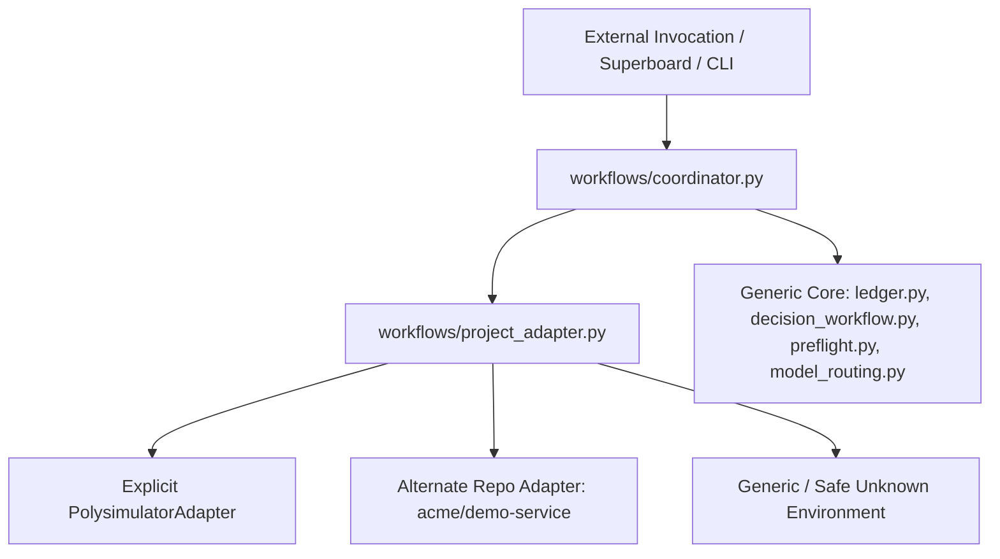

# Portable Workflow Core & Module Integration Guide

A harness-agnostic, pure Python standard library multi-agent coordination core located under `workflows/`.

---

## 1. Architectural Authority & Inviolable Principles

1. **Shared System of Record (Canonical):**
   * **GitHub Issues** and **Superboard (Project #1)** for `Bavariance/polysimulator` are the authoritative shared sources of truth for requirements, task status, human decisions, and verified closure.
   * Remote status always supersedes local caches on conflict.
2. **Local Recovery Cache:**
   * `ledger.json` and `decisions.json` act as machine-local, crash-resilient, atomic restart recovery caches.
   * They eliminate reliance on fictitious native schedulers or polling GitHub APIs continuously.
   * Multi-agent concurrency is protected via advisory file locking (`msvcrt` on Windows, `fcntl` on POSIX) and atomic filesystem replaces (`tempfile.mkstemp` + `os.replace`).
3. **No Auto-Merge & No Auto-Deploy:**
   * Transition to `integration` strictly requires an explicit human authorization record (`authorization.status == "authorized"` with recorded provenance). Self-authorization and default CLI operator trust are rejected.
   * Production deployment, staging promotion, and main branch merges cannot be authorized via issue decisions or autonomous routines.
4. **No Self-Spawn Loop:**
   * The coordinator command is strictly bounded: it executes **one evaluation step** and emits a compact recommendation packet.
   * It never recursively self-spawns worker agents, enters unbounded polling loops, or forks background daemons.
5. **No Credential Exposure:**
   * Quota, balance, and probe utilities sanitize and redact all account identifiers, emails, project refs, and tokens.
6. **Head-Bound Evidence Invalidation:**
   * Git HEAD changes invalidate all head-bound acceptance criteria, QA proof URLs, and review signoffs, automatically resetting state to `implementation`.

---

## 2. Module CLI Interface & Owner Map

| Module | Owning Agent Lane | Architectural Role | CLI Interface | Primary Inputs | Primary Outputs |
| :--- | :--- | :--- | :--- | :--- | :--- |
| **`coordinator.py`** | `PortableWorkflowCoordinator` | Single bounded coordinator combining state, decision sync, preflight gating, normalized usage, and model selection. | `python coordinator.py [--state-dir <dir>] [--json] [--summary] [--no-sync-decisions] [--usage-adapter auto\|file\|veyyon\|direct] [--balance-file <file>]` | `ledger.json`, `decisions.json`, `preflight_evidence/`, `usage_fixture.json` | `CoordinatorPacket` (JSON or terminal summary) |
| **`ledger.py`** | `ImplementRequestLedger` / `FixLedgerInvariants` | Machine-local durable request ledger, transition graph validator, per-criterion evidence verification, and restart recovery. | `python ledger.py [add \| update \| check \| next \| list \| show \| recover] [--ledger <path>]` | `ledger.json` | State transitions, invariant reports, recovery queues |
| **`decision_workflow.py`** | `IntegrateDecisionWorkflow` / `HardenDecisionProvenance` | Asynchronous human decision workflow with strict responder authorization, authored-comment exclusion, and bounded sync. | `python decision_workflow.py [ask \| ingest \| reply \| sync \| show \| list] [--decisions <path>] [--ledger <path>]` | `decisions.json`, GitHub issue comments via `gh` | Verified human decisions, unblocked ledger requests, clarification prompts |
| **`preflight.py`** | `ImplementIntegrationPreflight` | Manifest-driven staging integration preflight gates (Dokploy staging compose, Supabase staging ref, Stripe test mode). | `python preflight.py [check \| probe \| record-evidence \| inventory] [--evidence-dir <dir>] [--json]` | Task manifests, service probe evidence | `PreflightResult` (passed, blocked, not_applicable), probe inventory |
| **`balance_loader.py`** | `ImplementSubscriptionRouter` / `ReviewHarnessStrongModel` | Read-only sanitized subscription usage snapshot loader, multi-window constraint analyzer, and provider quota tracker. | `python balance_loader.py [--normalized] [--adapter veyyon\|file\|direct] [--balance-file <file>] [--json]` | `usage_snapshot_cache.json`, `usage_fixture.json`, or live CLI | `NormalizedBalanceSnapshot` (JSON) |
| **`model_routing.py`** | `ImplementHarnessRouting` / `ImplementSubscriptionRouter` | Capability-first, reset-aware model selection, near-reset Codex promotion, and compact EvidencePacket generation (< 1.5 KB). | `python model_routing.py [--task-type <type>] [--risk-level <level>] [--emit-dispatch] [--adapter veyyon\|file\|direct] [--balance-file <file>]` | `NormalizedBalanceSnapshot` | `HarnessDispatchPacket` (JSON) |
| **`github_plan_renderer.py`** | `IntegrateVisualPlanWorkflow` | Visual plan and evidence recap markdown renderer with badges, timelines, and progress metrics for GitHub issue/PR comments. | `python github_plan_renderer.py [--spec <file>] [--type plan\|recap]` | Plan or recap JSON specification | Formatted GitHub Markdown comment text |
| **`telegram_notifier.py`** | `IntegrateTelegramStatus` | Portable Telegram workflow status notification adapter with strict deduplication, cooldowns, single-sentence formatting, and multi-repo destination resolution. | `python telegram_notifier.py [--packet <file>] [--event-type milestone\|blocker\|decision\|completion] [--project <name>] [--send] [--dry-run] [--test-connection] [--json]` | `CoordinatorPacket` JSON, CLI event arguments, manifest/channel config | `DeliveryReceipt` (JSON or terminal summary), deduplicated Telegram messages |
---

## 3. Single Bounded Coordinator Command

The coordinator command evaluates current state across all modules in one deterministic pass:

```bash
# Human-readable summary output
python coordinator.py --summary

# Machine-readable JSON output (default)
python coordinator.py --json

# Standalone execution with custom state directory and usage fixture
python coordinator.py \
  --state-dir /path/to/state \
  --usage-adapter file \
  --balance-file /path/to/usage_fixture.json \
  --no-sync-decisions \
  --json
```

### Coordinator Command Options

* `--state-dir <dir>`: Root directory for `ledger.json`, `decisions.json`, and `preflight_evidence/` (defaults to script directory).
* `--ledger <path>`: Explicit override for `ledger.json`.
* `--decisions <path>`: Explicit override for `decisions.json`.
* `--evidence-dir <path>`: Explicit override for `preflight_evidence/` directory.
* `--usage-adapter <auto|file|veyyon|direct>`:
  * `auto` (default): Checks for balance file or fixture; if missing, checks for `veyyon` CLI; falls back to internal normalized snapshot.
  * `file`: Loads normalized metrics from `--balance-file` or `usage_fixture.json`.
  * `veyyon`: Invokes `veyyon usage --json` on host.
  * `direct`: In-memory direct structure.
* `--balance-file <file>`: Path to custom usage JSON fixture.
* `--repo <repo>`: Target GitHub repository (default: `Bavariance/polysimulator`).
* `--no-sync-decisions`: Skip remote GitHub decision synchronization (useful in offline or test environments).
* `--request-id <id>`: Target specific request ID instead of highest-priority eligible request.
* `--json`: Emit machine-readable JSON packet.
* `--summary`: Emit formatted terminal summary.

### Coordinator Output Schema (`CoordinatorPacket`)

```json
{
  "schema_version": "1.0",
  "generated_at_utc": "2026-09-05T09:10:32Z",
  "status": "ready",
  "status_reason": "Request 'req-001' is eligible for execution in state 'implementation'. Preflight passed.",
  "next_action": "Dispatch worker lane using model 'google-antigravity/gemini-3.8-flash:high' (role: task)...",
  "request": {
    "id": "req-001",
    "state": "implementation",
    "task_type": "harness",
    "owner": "ImplementHarnessRouting",
    "prompt": "Task objective...",
    "head": "a1b2c3d4",
    "issue_number": 4545,
    "issue_url": "https://github.com/Bavariance/polysimulator/issues/4545",
    "next_action": "Implement criteria...",
    "pending_criteria": ["AC-1", "AC-2"],
    "labels": ["area:orchestration"]
  },
  "decision_status": {
    "sync_attempted": true,
    "sync_success": true,
    "sync_message": "Sync completed: checked 0 decision(s).",
    "pending_count": 0,
    "blocking_this_request": false,
    "blocking_decision_ids": [],
    "decision_details": null
  },
  "preflight": {
    "evaluated": true,
    "passed": true,
    "status": "passed",
    "required_probes": ["dokploy_staging"],
    "blockers": [],
    "probe_details": {
      "dokploy_staging": "passed"
    }
  },
  "routing": {
    "evaluated": true,
    "recommended_model": "google-antigravity/gemini-3.8-flash:high",
    "recommended_role": "task",
    "fallback_model": "openai-codex/gpt-5.3-codex",
    "promotion_applied": false,
    "cooldown_fallback": false,
    "rationale": "Primary abundant execution lane: Gemini 3.8 Flash (Ultra daily allowance).",
    "quota_context": {
      "provider_statuses": {
        "google-antigravity": "ok",
        "anthropic": "ok",
        "openai-codex": "ok",
        "xai-oauth": "dormant"
      }
    },
    "evidence_packet_required": false
  },
  "evidence_packet": null,
  "boundaries": {
    "auto_merge_allowed": false,
    "auto_deploy_allowed": false,
    "self_spawn_loop": false,
    "execution_dispatched": false,
    "shared_authority": "GitHub Issues & Superboard (Project #1)",
    "local_recovery_cache": "ledger.json"
  }
}
```

### Status Meaning & Invariant Actions

* **`ready`**: Request has passed preflight, has no decision blockers, and is ready for worker execution.
  * *Action:* Dispatch worker using recommended model/role for the specified `next_action`.
* **`wait`**: Request is blocked pending human decision (e.g. `decision_blockers`) or is in `awaiting authorization`.
  * *Action:* Background workers must park. Do not speculative branch or burn tokens. Await human response on GitHub issue or explicit authorization in ledger.
* **`block`**: Request has unsatisfied dependencies or missing staging preflight evidence (Dokploy/Supabase/Stripe).
  * *Action:* Run safe read-only preflight probe (`python preflight.py probe --all`) or complete upstream dependency requests.
* **`done`**: All requests in ledger are in terminal `done` state or no active requests exist.
  * *Action:* No work remaining. Conclude session or await new operator prompts.

---

## 4. Standalone Execution (Zero Veyyon Requirement)

The package runs anywhere with standard Python 3.9+ and optionally the GitHub CLI (`gh`):

1. **No External Libraries:** Uses Python standard library only (`argparse`, `json`, `os`, `sys`, `dataclasses`, `hashlib`, `threading`, `time`, `subprocess`).
2. **Missing `gh` Tool:** Automatically skips remote decision sync with an informative notice; local decision evaluations and state transitions continue uninterrupted.
3. **Missing `veyyon` Tool:** With `--usage-adapter file` (or `auto`), reads normalized quota metrics from `usage_fixture.json` with zero host daemon requirement.
4. **Custom State Paths:** Use `--state-dir` or explicit `--ledger` / `--decisions` flags to isolate state in temporary or project directories without touching `~/.veyyon`.

---

## 5. Harness Adapter Integration Instructions

### Adapter A: Veyyon Orchestrator & Goal Mode

When running under Veyyon (with orchestrators like GPT-5.6 Sol or Astra):

1. **Step Evaluation:**
   The interactive orchestrator invokes `python workflows/coordinator.py --json`.
2. **Packet Processing:**
   * Parse returned JSON packet.
   * If `status == "wait"`:
     * Log waiting status: `"Workflow parked waiting on human decision {id} or operator authorization."`
     * Yield turn or enter idle wait. **Never self-authorize or bypass.**
   * If `status == "block"`:
     * If preflight blocked: invoke read-only probe or report missing staging credentials.
   * If `status == "ready"`:
     * Read `routing.recommended_model` and `routing.recommended_role`.
     * Spawn execution lane via Veyyon `task` tool:
       ```json
       task(
         tasks=[{
           "agent": packet["routing"]["recommended_role"],
           "task": packet["next_action"]
         }]
       )
       ```
   * If `status == "done"`:
     * Mark session goal complete via `goal(op="complete")` and yield final summary.

### Adapter B: OpenAI Codex / Anthropic Claude / Custom Runners

Generic external orchestrators (Codex, Claude, Claude Code, GitHub Actions, custom shell scripts) use the coordinator as an idempotent oracle:

```python
#!/usr/bin/env python3
"""Example driver script for external orchestrators."""
import json
import subprocess
import sys

def run_step():
    # 1. Evaluate single bounded step
    cmd = [
        sys.executable, "workflows/coordinator.py",
        "--usage-adapter", "file",
        "--balance-file", "workflows/usage_fixture.json",
        "--json"
    ]
    res = subprocess.run(cmd, capture_output=True, text=True, check=True)
    packet = json.loads(res.stdout)

    status = packet["status"]
    print(f"Coordinator Status: {status}")
    print(f"Next Action: {packet['next_action']}")

    if status == "ready":
        # Dispatch execution in your harness
        model = packet["routing"]["recommended_model"]
        print(f"Dispatching task to model {model}...")
    elif status == "wait":
        print("Execution paused: human decision or authorization required.")
    elif status == "block":
        print(f"Execution blocked: {packet['status_reason']}")
    elif status == "done":
        print("All workflow tasks complete.")

if __name__ == "__main__":
    run_step()
```

### Adapter C: Optional Telegram Notification Adapter

For real-time human updates, an external notification adapter (`telegram_notifier.py`, owned by `IntegrateTelegramStatus`) consumes coordinator packets or ledger state changes and emits one-sentence deduped updates without polling spam or parallel state tracking:
* **Canonical System of Record:** Status is always anchored to GitHub Issues and Superboard; Telegram is strictly a read-only push channel.
* **Deduped Event Types:** Emits events exclusively on major milestones (`milestone`), active blockers (`blocker`), decision requests (`decision`), or closure (`completion`), referencing the canonical issue URL.
* **Generic Multi-Repo Transport:** Resolves per-project slot destinations dynamically via manifest/affinity matching (`Bavariance/polysimulator`, `Wladefant/super-board`, `soundcore`, `dubai-holding`, `heylolo`, `heyloweb`).
* **Credential Redaction:** Tokens, bearer headers, and user paths are sanitized before dispatch. Bot tokens are held in-memory only.
* **Deduplication & Cooldown:** Uses SHA256 event signatures with 24-hour deduplication, 5-minute per-request cooldowns, and a 30-second global rate limiter to eliminate spam.

```bash
# Check bot connectivity and allowlisted destinations (read-only getMe)
python telegram_notifier.py --project Bavariance/polysimulator --test-connection --json

# Dry-run evaluate an event without network transmission
python telegram_notifier.py \
  --event-type decision \
  --project "Bavariance/polysimulator" \
  --request-id "req-4543" \
  --summary "Request paused awaiting human decision on DEC-4543-01." \
  --link "https://github.com/Bavariance/polysimulator/issues/4543#issuecomment-5550731410" \
  --dry-run \
  --json

# Consume a CoordinatorPacket file and dispatch if eligible
python telegram_notifier.py --packet coordinator_output.json --send
```
---

## 6. Export Procedure & Verification

To export the portable workflow package to an isolated directory:

```bash
# Export destination
EXPORT_DIR="/tmp/portable_workflow"
mkdir -p "$EXPORT_DIR"

# Copy core files
cp workflows/coordinator.py "$EXPORT_DIR/"
cp workflows/ledger.py "$EXPORT_DIR/"
cp workflows/decision_workflow.py "$EXPORT_DIR/"
cp workflows/preflight.py "$EXPORT_DIR/"
cp workflows/balance_loader.py "$EXPORT_DIR/"
cp workflows/model_routing.py "$EXPORT_DIR/"
cp workflows/github_plan_renderer.py "$EXPORT_DIR/"
cp workflows/github_plan_templates.py "$EXPORT_DIR/"
cp workflows/usage_fixture.json "$EXPORT_DIR/"
cp workflows/manifest.json "$EXPORT_DIR/"
cp workflows/PORTABLE.md "$EXPORT_DIR/"

# Run standalone verification in export directory
cd "$EXPORT_DIR"
python coordinator.py --summary
```
---

## 7. Multi-Repository Portability & Project Adapters

The workflow core is strictly decoupled from any single product or environment through `workflows/project_adapter.py`.

### 7.1 Generic Core vs Project Adapter Architecture



1. **Generic Core:** Accepts arbitrary repository (`--repo` or `--project-config`), Superboard project number, base branch, and staging definitions. Zero project-specific strings are hardcoded into validation logic.
2. **PolySimulator Adapter (`polysimulator`):**
   * Encapsulates authoritative staging compose ID (`TU7b_dY9l9_nCas6YBNwj`) and staging DB ref (`hgzyqmaanndcimnclxtv`).
   * Inviolable invariant: **ZERO production or main DB access**. Main DB (`zaraprptkegxqpvnsubu`) and production compose ID (`vpyL-7TDEUREH6Uo_y1sb`) are strictly rejected.
3. **Alternate Repository Fixture (`acme/demo-service`):**
   * Configured via `workflows/fixtures/alternate_repo_config.json` (project #42, `main` base branch).
   * Proves zero PolySimulator defaults leak into packet summaries or boundaries.
4. **Safe Unknown Environment (`isolated/unknown-project`):**
   * Unconfigured staging environment safely exempts local_doc / harness tasks as `not_applicable`.
   * Deployable tasks requiring external staging are cleanly BLOCKED with unconfigured explanation, never falling back to PolySimulator staging.

### 7.2 Superboard Repository Discovery & Native Config Support

The user's authoritative Superboard repository was discovered:
* **GitHub Repository:** `Wladefant/super-board` (URL: `https://github.com/Wladefant/super-board`, forked from `EricTechPro/super-board`).
* **Local Checkout:** `C:\Users\wkiri\development\super-board` and `C:\Users\wkiri\.claude\super-board-src`.
* **Configuration Compatibility:** The project adapter natively parses Superboard project configs (`.claude/super-board/configs/<slug>.json`), extracting `repo.remote`, `project.number`, `base_branch`, and `deploy.compose_id`.

### 7.3 Verification & Cross-Repository Smoke Test

Run the cross-repository smoke test to verify isolation across all 3 tiers:
```bash
python workflows/cross_repo_smoke_test.py
```
Verifies PolySimulator staging preservation, alternate repo fixture execution with zero leakage, and safe unknown environment handling (100% success).

